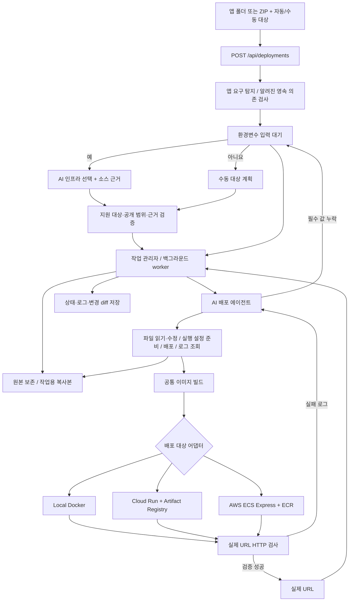

# OneDeploy — AI가 수행하는 배포

## 목표

사용자가 로컬 앱을 주고 배포를 요청하면, AI가 필요한 작업을 수행해 실행 중인 서비스 URL을 반환한다.
분석 보고서의 품질이 아니라 사용자가 배포를 위해 직접 해야 하는 작업을 줄이는 것이 목적이다.
원문 주제의 중심은 AI가 앱에 필요한 코드 변경과 적절한 인프라 구성을 함께 수행하는 것이다.
현재 지원 범위는 단일 Node.js 앱 또는 기존 Dockerfile이 있는 웹 앱을 Local Docker, Google Cloud Run 또는 AWS ECS Express Mode에 배포하는 경로다.
Cloud Run은 현재 구현된 어댑터일 뿐 요구사항이 지정한 우선 대상은 아니다. 실무 적용 대상은
앱의 상태 저장 방식, 상시 실행 필요성, 조직의 클라우드 계정·네트워크·권한 체계에 따라 결정해야 한다.

## 주제 충족을 위한 확장 방향

현재는 사용자가 대상을 고르고 어댑터가 해당 대상의 고정된 기반 리소스를 만든다. 이는 자동 배포와
인프라 생성의 첫 경로이지만, 앱에 맞는 인프라를 **판단**하는 기능은 아니다. 기존 업로드·작업 관리·
코드 패치·이미지 빌드·AWS 생성·검증·복구 엔진을 유지하고, 그 앞에 다음 단계를 추가한다.

1. 앱의 실행 방식, 데이터 저장, 백그라운드 작업, 네트워크 요구, 환경변수를 근거 파일과 함께 식별한다.
2. AI가 지원 가능한 리소스 종류와 설정만 사용해 구조화된 인프라 계획을 제안한다. 대상, 서비스,
   데이터 저장소, 공개 범위, 필요한 코드 변경, 비용·위험 근거를 한 계획에 묶는다.
3. 서버가 실제 계정의 가용 대상·권한·정책·비용 한도와 계획을 대조한다. AI에는 임의 셸이나
   클라우드 CLI 권한을 주지 않는다. 지원하지 않는 요구는 조용히 무시하지 않고 차단한다.
4. 작업용 소스의 변경과 승인된 리소스 구성을 같은 계획의 일부로 실행한다. 실패 시 어떤 리소스가
   생성됐는지 기록하고 소유권 확인 후 복구한다. 실제 서비스·데이터 경로 검증을 성공 조건으로 삼는다.

첫 확장 단위는 현재의 무상태 웹 앱에서 **자동 대상 선택과 계획 검증**이다. AI가 소스 근거를
제시하며 사용 가능한 대상 중 하나를 선택하고, 서버가 대상·공개 범위·근거·지원 작업 유형을
확인한 뒤 기존 실행기에 넘긴다. 수동 대상 선택도 유지한다. 정적 검사에서 SQLite 코드·DB 파일,
PostgreSQL·MySQL·MongoDB 등의 런타임 의존성·소스·Prisma 설정,
명시적 `data/`·`uploads/`·`storage/` 파일 쓰기, 워커 스크립트·의존성을 발견하면 현재 단일
컨테이너 경로와 맞지 않으므로 리소스 생성 전에 거부한다. 이는 알려진 패턴에 대한 보수적
검사이며, 감지되지 않은 앱의 무상태성을 보증하지 않는다. 이후 영속 데이터 앱을 위한 DB 프로비저닝·
접속 설정·마이그레이션 경로를 하나씩 추가한다. DB 이전은 원문에서 제시한 예시이지 모든 앱에
무조건 수행할 작업은 아니다. 대상 수를 늘리는 것보다 앱과 인프라의 적합성을 실제로 검증하는 데 집중한다.

## 사용자 흐름

앱 폴더/ZIP → 앱 ID·대상 자동 선택 또는 수동 지정 → 배포하기 → 실제 작업 진행 → URL.
앱 ID로 릴리스를 묶고 같은 앱·대상에서 진행 중인 배포가 있으면 중복 실행을 거부한다.
분석 결과나 수정 계획의 별도 승인은 요구하지 않는다. 작업용 복사본을 사용하고 변경 diff를 기록한다.
시스템이 알 수 없는 실행 환경값만 진행 중 요청하며, 입력 후 같은 작업을 이어간다.

## 실행 구조

에이전트가 순서대로 도구를 선택한다. `function_call_output`으로 실제 작업 결과를 돌려주고 다음 작업을 결정한다.
Responses API의 함수 호출을 사용하며, 소스·로그는 지시가 아닌 비신뢰 입력 데이터로 취급한다.
현재 모델 호출은 stateless 방식으로 도구 결과 및 reasoning 항목을 이어 전달한다.
원문 모델 대화는 디스크에 저장하지 않는다. 사용자에게는 수행 도구와 실행 결과를 기록한다.

## 도구와 책임

| 도구 | 실제 동작 |
| --- | --- |
| read_project_files | 허용된 작업용 소스 읽기, 주요 민감 패턴 마스킹 |
| apply_project_patch | 읽은 파일의 정확히 일치하는 구간 수정 또는 새 파일 작성 |
| configure_deployment | 기존 Dockerfile 또는 npm 스크립트, 포트·HTTP 경로 검증 후 컨테이너 준비 |
| deploy_application | 별도 시도 디렉터리에서 이미지 빌드·환경별 배포·HTTP 검사 |
| read_runtime_logs | 최근 빌드·실행 결과 반환 |
| request_environment | 이름만 지정해 사용자 입력 대기로 전환 |
| report_blocker | 구체적인 해결 불가 사유를 남기고 실패 처리 |

`deploy_application`은 공통 이미지 빌더 뒤에 선택한 환경의 배포 어댑터를 호출한다.
자동 대상 선택은 별도 구조화된 응답으로 수행한다. 모델이 허용된 대상 하나, 지원 작업 유형,
간단한 이유, 실제 소스에서 확인 가능한 인용을 반환해야 한다. 서버는 사용 가능한 CLI·계정 설정과
인터넷 공개 허용 여부를 먼저 후보로 제한한다. AWS ECS Express는 공개 허용 없이는 후보에 넣지 않는다.
모델이 지원하지 않는 데이터·워커 요구를 보고하거나 근거·대상 검증에 실패하면 리소스를 생성하지 않는다.
실제 생성 리소스 목록은 AI 문자열이 아니라 선택된 어댑터의 고정 정책에서 도출해 이력에 남긴다.
Cloud Run 어댑터는 필요한 API·Artifact Registry 저장소·실행 서비스 계정을 준비하고,
로컬에서 `linux/amd64` 이미지를 빌드해 업로드한 뒤 서비스를 배포한다. AI는 프로젝트 인증이나
클라우드 CLI를 직접 호출하지 않는다. 모든 CLI 인자는 서버가 만든 고정 절차로 조합한다.

Cloud Run은 기본 비공개 서비스다. 사용자가 명시적으로 공개를 선택했을 때만 공개 배포 플래그를 전달한다.
비공개 서비스는 CLI의 ID 토큰을 붙여 HTTP 응답을 검증한다. URL은 Cloud Run 도메인인지 확인하고,
검증 요청의 리다이렉트를 따르지 않는다. 서비스 이름에 작업 ID를 넣고 기존 서비스가 있으면 덮어쓰지 않는다.
실패 정리 때도 작업 ID와 관리 라벨이 일치하는 서비스만 삭제 대상으로 삼는다.
이미지 로그인은 짧은 수명의 액세스 토큰을 stdin으로 전달하며 임시 Docker 인증 설정을 호출 후 삭제한다.

AWS 어댑터는 CloudFormation 템플릿으로 ECR 저장소와 ECS Express용 실행·인프라 역할을 준비한다.
`linux/amd64` 이미지를 고유 태그로 ECR에 업로드하고, 태스크 수 1개로 제한한 공개 ECS Express 서비스를
만든다. 같은 앱 ID의 다음 AWS 작업은 서비스 소유권과 이전 배포 성공을 확인하고 새 서비스 리비전으로
업데이트한다. AWS가 Fargate·로드 밸런서·네트워크를 구성한다. 업데이트는 새 배포가 `SUCCESSFUL`이고
동일한 HTTPS URL에서 200 응답을 확인해야 완료한다.
공개 접근을 사용자가 명시적으로 선택하지 않으면 AWS 배포를 거부한다. 현재 비공개 VPC 경로는 지원하지 않는다.
실패 정리에서는 서비스 ARN과 이번 시도의 관리 태그가 일치하는 서비스만 삭제를 시도한다.
공유 CloudFormation 스택은 실패 정리 중 삭제하지 않는다. 2026-09-28 실제 AWS 계정에서
샘플 앱의 공개 HTTPS 200 응답까지 검증했다. AWS 서비스 `ACTIVE` 직후에도 하위 리소스와 DNS가
준비 중일 수 있어 HTTP 검증을 계속 재시도한다.
성공한 AWS 배포는 작업별 종료 API로 관리한다. 계정 ID, 서비스 ARN, 이미지 태그, 관리 태그를
확인한 뒤 ECS 서비스를 종료하고 `INACTIVE`를 확인한 다음 해당 서비스의 릴리스 ECR 태그들을 삭제한다.
종료 상태는 작업 이력에 남기며 공유 기반 스택은 유지한다.
Local Docker 종료는 작업 ID와 컨테이너·이미지 이름 및 Docker 관리 라벨을 확인한 뒤 해당
컨테이너와 이미지 태그만 삭제한다. 도중에 중단되면 `delete_failed`로 복원해 재시도한다.
Cloud Run 종료는 저장된 프로젝트·리전·서비스·이미지를 확인하고 실제 서비스의 관리 라벨·URL·컨테이너 이미지를
대조한다. 서비스 삭제가 목록에 반영된 뒤 해당 Artifact Registry 이미지를 삭제한다. 공유 저장소는 유지한다.

기존 Dockerfile은 업로드한 파일을 우선 사용하며 AI가 작업용 복사본에서 내용을 읽고 수정할 수 있다.
Dockerfile이 없으면 `package.json`의 검증한 npm 스크립트로 템플릿을 생성한다. 기존 Dockerfile이 있으면 `package.json`은 필수가 아니다. 앱 소스와 실행·빌드 스크립트도
작업용 복사본에서 수정할 수 있다. 기존 Dockerfile의 빌드·실행 명령은 Docker 빌드와 HTTP 검증으로 확인한다.
지원 범위 내 배포 자동화를 우선하고 모든 앱·인프라를 포괄하는 자율 셸 실행은 이번 범위에서 제외한다.

## 성공·실패·재시도

AI가 완료했다고 말하는 것으로 성공 상태를 만들 수 없다. 실제 컨테이너 HTTP 검증 결과가 필요하다.
파일 수정 후 준비된 설정을 무효화하고 재구성하도록 강제한다. 빌드 직전 소스 digest도 확인한다.
최대 3회 배포, 총 24회 도구 호출을 허용한다. 최초 시도 실패 후 수정 재시도는 최대 2회다.
실패 결과와 로그를 모델에 돌려주며 실패한 시도의 컨테이너·앱 이미지만 정리를 시도한다.
정리를 확인하지 못하면 로그에 해당 리소스를 남긴다. 원본 업로드 소스는 수정하지 않는다.

## 환경변수와 복구

입력 요청 시 환경변수 이름과 이유를 저장하고 worker를 종료한다. 입력값은 영구 저장하지 않으므로
재개 시 이전에 입력했던 이름도 필요하면 다시 요청한다. 값은 runtime env 파일로만 전달한다.
재개는 현재 작업용 파일과 누적 시도·도구 호출 수를 바탕으로 새 모델 대화를 시작한다.
이전 전체 모델 대화는 복원하지 않는다. Dockerfile 내용은 설정에 기록한다. 새로 생성하는 Dockerfile은 빌드 시도 디렉터리에만 작성하고, 업로드한 Dockerfile의 수정은 작업용 복사본에만 적용한다.

서버 시작 시 작업 기록을 복원한다. `waiting_input`은 재개할 수 있고, `running`은 `interrupted`로 바꾼다.
자동 재배포나 실행 컨테이너 상태 추정은 하지 않는다. 단일 서버·신뢰 가능한 로컬 앱을 전제로 한다.
CLI 서버는 상태 디렉터리에 파일 잠금을 유지해 다른 서버의 동시 사용을 거부한다. 작업 기록은
권한 0600의 임시 파일에 기록·동기화한 뒤 원자적으로 교체한다. 저장 실패 시 메모리 상태도 실패로
표시하며, 이미 시작한 컨테이너나 클라우드 서비스의 상태는 별도 확인이 필요하다.
성공 이력은 배포 직후 검사 결과로 보존한다. 사용자가 현재 상태를 다시 확인하면 Docker 컨테이너나
Cloud Run 서비스의 소유 정보와 실행 상태를 먼저 검사하고, 저장된 URL에 HTTP 200을 다시 확인한다.
재검사 결과는 별도 응답이며 과거 성공 이력이나 배포 상태를 조용히 덮어쓰지 않는다.
CLI 서버는 활성 성공 배포를 기본 5분마다 자동 재검사한다. 같은 앱·대상의 새 배포가 진행 중이면
건너뛴다. 최근 20건의 자동·수동 확인 결과는 `health.json`에 별도로 원자 저장하고 UI에 표시한다.
상태 기록 실패는 배포의 과거 성공 상태를 변경하지 않는다. 서버가 꺼져 있는 동안에는 검사하지 않는다.

## API

- `POST /api/deployments`: 폴더/ZIP 업로드와 AI 배포 시작. 대상은 X-Deploy-Target 헤더(`auto` 또는 명시적 대상).
- `POST /api/deployments/<id>/resume`: environment JSON으로 입력 대기 작업 재개.
- `POST /api/deployments/<id>/cancel`: 입력 대기 작업을 취소하고 앱 ID 점유 해제.
- `GET /api/jobs`, `GET /api/jobs/<id>`: 배포 진행·결과·이력.
- `GET /api/jobs/<id>/health`: 성공한 배포의 현재 서비스 소유 정보와 HTTP 응답 재검사 및 기록.
- `GET /api/applications/<app-id>/releases`: 앱 ID별 배포 이력과 AWS 활성·이전 릴리스 상태.
- `POST /api/jobs/<id>/retire`: 소유권 확인 후 성공한 Local Docker, Cloud Run 또는 AWS 배포를 종료하고 해당 이미지 정리.
- `POST /api/jobs/<id>/rollback-release`: 현재 AWS 릴리스를 `target_job_id`로 지정한 같은 서비스의 성공 이력으로 재배포. 본문이 없으면 직전 릴리스를 사용.
- `POST /api/jobs/<id>/rollback-release/reconcile`: 결과가 불확실한 릴리스 롤백의 실제 ECS 상태를 재확인.
- `GET /api/config`: 연결 설정 여부와 지원 대상. API 키는 반환하지 않음.

이전 분석·계획 API는 회귀 검증용으로 남아 있으며 제품 UI에서는 사용하지 않는다.

## 검증 및 남은 범위

테스트용 모델 응답으로 도구 실행·파일 수정·실제 Docker 실패/복구 경로를 검증한다.
이 결과는 실제 AI 추론 정확도의 증거가 아니다. API 키가 설정된 환경에서 live 검증이 별도로 필요하다.
Cloud Run 어댑터는 명령·구성·실패 정리 테스트만 통과했다. `gcloud`와 프로젝트 설정이 없어 실제 GCP
배포 검증은 남아 있다. AWS는 실계정에서 생성·동일 URL 업데이트·공개 HTTP 검증을 완료했다.
DB 마이그레이션, 실행 중 배포 취소, 다중 사용자 격리는 아직 미구현이다.
실패한 AWS 업데이트가 진행 중일 때는 소유권과 양쪽 리비전 이미지를 확인하고 ECS 롤백을 요청할 수 있다.
완료된 AWS 릴리스는 선택한 과거 성공 릴리스의 태스크 정의를 같은 서비스에 재배포하고 상태를 확인한다.
동일 앱 ID의 AWS 배포는 서비스 URL을 유지하고 이전 릴리스를 `superseded`로 표시한다.
Local Docker와 Cloud Run의 릴리스는 배포마다 별도 리소스를 만들며 수동 롤백을 지원하지 않는다.
따라서 현재 구현을 운영 환경용 배포 플랫폼으로 취급해서는 안 된다.
