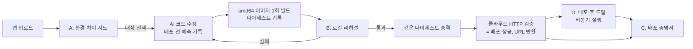

# 독창성 설계 — 스스로 의심하는 배포

기준: 2026-10-06. **목표 설계 문서다. 환경 비교 화면, AWS 무상태 리허설·승격, 증명서 v1은 구현됐고 자동 드릴과 다중 대상 배포는 미구현이다.** 구현한 부분과
새로 만들 부분은 각 절에서 구분한다. 관련 문서는 [설계](design.md),
[이식성 청사진](portability-blueprint.md), [현재 상태](status.md),
[후속 실환경 검증 계획](deferred-verification.md), [남은 작업 로드맵](roadmap.md),
[목표 설계](target-design.md)다. 이 문서의 기능은 목표 설계의 일부다.

## 0. 이 문서가 바뀐 과정

이 문서는 세 번 고쳐 썼다. 결론만 남기지 않고 과정을 기록한다.

1. **첫 안 (2026-10-05):** "증명하는 배포"라는 개념 아래 세 기능을 묶었다.
   환경 차이 지도, 로컬 리허설 후 같은 이미지 승격, 배포 증명서다.
2. **자기 평가 (2026-10-06):** 세 기능을 각각 선행 사례와 대조했다. 모두 실무에서
   이미 쓰이는 방식이었다.

   | 기능 | 선행 사례 | 판단 |
   | --- | --- | --- |
   | 같은 이미지 승격 | "한 번 빌드, 여러 환경 승격"은 CI/CD 기본 원칙. Argo CD, Spinnaker 등 | 좋은 관행이지만 독창성이 아니다. 오히려 지금 안 하는 것이 결함이다 |
   | 배포 증명서 + 해시 체인 | SLSA provenance, in-toto, Sigstore(cosign, Rekor 투명성 로그) | 표준을 다시 만드는 셈. "검증하지 않은 것까지 적는다"는 점만 약간 차별적 |
   | 환경 차이 지도 | 클라우드 마이그레이션 적합성 평가 도구 | 시연에서는 표 하나라 인상이 약하다 |

3. **방향 전환:** 세 기능은 버리지 않고 **실무 수준의 기반**으로 둔다. 독창성의
   중심은 이 프로젝트가 실제로 해 온 일에서 찾았다. 지금까지 실계정에서 재시작,
   롤백, 백업 복원, 데이터 표식 대조를 **사람이 수동 드릴로** 검증해 왔다. 이것을
   제품 기능으로 만든다.
4. **테마 적합성 재검토 (2026-10-06):** "One Action, Infinite Clouds"에 비춰 다시 봤다.
   - **One Action**은 충족한다. **Infinite Clouds**가 약하다. 실제로 쓰는 클라우드는
     AWS 하나이고, Cloud Run은 실계정 배포 이력이 없다. 드릴 중심 개념은 신뢰성의
     이야기라서 그 자체로는 "여러 환경"을 말하지 않는다.
   - 앞서 채택하지 않은 "여러 클라우드 동시 배포"가 너무 보수적이었다고 판단해
     **다중 대상 배포를 다시 채택**했다(7절).
   - 검토 중 세 가지를 바로잡았다.
     1. **Cloud Run 실배포는 행사 요구사항의 필수 조건이 아니다.** 브리프는 클라우드
        선택을 자유롭게 두고 로컬 환경도 대상으로 인정한다. AWS와 Local로 요구사항은
        충족된다. GCP 실배포는 "여러 클라우드에서 증명했다"고 말하기 위한 **선택적인
        강한 시연 목표**다.
     2. **순서대로 실행하는 것만으로는 실패가 격리되지 않는다.** 대상별 상태·비용·정리·
        재시도·증명서를 독립적으로 관리하고, 전체 결과는 `부분 성공`으로 보여줘야 한다.
     3. **원격 Docker는 `DOCKER_HOST` 변경만으로 끝나지 않는다.** 이미지 전달, 원격
        포트와 외부 URL, SSH 권한, 데이터 위치, 소유권 확인과 정리가 모두 달라진다.
        별도의 온프레미스 어댑터로 다룬다.
   - 다중 대상 버튼을 먼저 만들지 않는다. 단일 대상의 이식성을 먼저 실증한다.
     GCP 단일 경로조차 검증하지 않은 상태의 다중 대상 화면은 테마를 보여주는 화면일 뿐
     이식성의 증거가 아니기 때문이다.

## 1. 핵심 개념

> **배포가 끝나면, OneDeploy가 스스로 장애를 일으켜서 그 배포가 버티는지 증명한다.**

대부분의 배포 도구는 URL이 응답하면 끝난다. 재시작해도 살아나는지, 롤백이 실제로
되는지, AI의 판단이 맞았는지는 **가정**으로 남는다. OneDeploy는 그 가정을 직접
시험하고, 결과를 배포 증명서에 남긴다. 배포 도구가 자기 자신과 AI를 믿지 않는 것이
차별점이다.

이 개념이 이 프로젝트에서 특히 성립하는 이유는 세 가지다.

- **눈에 보인다:** 발표 중 컨테이너를 죽이면 서비스가 돌아오고 데이터가 남아 있다.
  표나 JSON보다 훨씬 강한 시연이다.
- **흉내 내기 어렵다:** 장애를 안전하게 주입하려면 소유권 검사, 작업 기록, 데이터
  표식, 롤백 경로가 먼저 있어야 한다. 이 저장소에는 이미 있다.
- **실무 가치가 있다:** 카오스 엔지니어링(일부러 장애를 내서 견고함을 확인하는 방법)을
  배포 과정 안에 자연스럽게 넣는다.

### 테마와 연결한 메시지

> **한 번의 동작으로 앱에 맞는 환경을 구성하고, 선택한 각 환경에서 같은 배포 기준으로
> 결과를 증명한다.**

드릴은 대상마다 따로 만든 검사가 아니라 **모든 대상에 적용하는 공통 기준**이다. 사용하는
수단은 대상마다 다르다(ECS는 태스크 교체, Cloud Run은 리비전, Docker는 재시작 정책).
하지만 "재시작해도 살아나는가, 되돌릴 수 있는가"라는 판정 기준은 같다. 그래서 드릴이
신뢰성과 이식성을 하나의 이야기로 묶는다.

이 메시지는 AWS의 깊이, 환경 간 이식성, 배포 증명서를 모두 담는다. Cloud Run까지
실계정에서 검증한 뒤에만 "여러 클라우드에서 증명했다"고 더 강하게 말한다.

## 2. 전체 구조

기반 기능 세 개(A~C) 위에 핵심 기능(D)을 얹는다.

| 층 | 기능 | 역할 |
| --- | --- | --- |
| 핵심 | **D. 배포 후 자동 드릴** | 재시작 내성, 롤백 리허설, AI 예측 채점, 백업 복원 드릴 |
| 기반 | A. 환경 차이 지도 | 배포 전에 대상별 가능 여부·변경·비용을 보여줌 |
| 기반 | B. 로컬 리허설 → 같은 이미지 승격 | 로컬에서 검증한 산출물과 클라우드 산출물을 같게 만듦 |
| 기반 | C. 배포 증명서 | 드릴 결과를 포함해, 검증한 것과 하지 않은 것을 기록 |
| 테마 | E. 공통 어댑터 계약과 다중 대상 배포 | 같은 산출물을 선택한 여러 대상에 배포하고, 대상별 결과를 독립적으로 증명 (7절) |

배포 성공 판정과 URL 반환은 지금처럼 **실제 HTTP 확인**에서 끝난다. 드릴은 그 뒤에
별도로 실행된다.

## 3. 핵심 기능 D — 배포 후 자동 드릴

### 3.1 공통 원칙

- **배포 시간을 늘리지 않는다.** 성공 판정과 URL 반환 뒤에 비동기로 실행한다.
  작업에는 `드릴 대기 → 실행 중 → 통과 / 실패 / 생략` 상태를 따로 둔다.
- **소유한 리소스에만 장애를 넣는다.** 기존 소유권 검사(태그, 이름 규칙, 작업 기록
  대조)를 통과한 컨테이너·태스크·서비스만 대상으로 한다.
- **실패해도 자동으로 되돌리지 않는다.** 드릴이 실패하면 배포를 `확인 필요`로 표시하고
  롤백 버튼을 제시한다. 결과가 불확실할 때 자동 재실행하지 않는다는 기존 원칙과 같다.
  자동 롤백은 사용자가 정책으로 켤 때만 한다.
- **생략도 기록한다.** 첫 릴리스라서 롤백할 이전 버전이 없거나, 무상태 앱이라서 데이터
  표식이 없으면 "생략"과 그 이유를 증명서에 남긴다.
- **실무 환경에서는 범위를 좁힌다.** 실제 사용자 트래픽이 있는 서비스에서는 트래픽을
  넘기기 전의 새 릴리스(카나리·블루그린 단계)에만 장애를 넣는다. 카나리·블루그린이
  구현되기 전에는 운영 서비스에서 기본값을 끈다.

### 3.2 D1. 재시작 내성

| 대상 | 방법 | 확인 |
| --- | --- | --- |
| Local Docker | 소유 컨테이너를 강제 종료 | 재시작 정책으로 복구되는지, HTTP 200이 돌아오는지 |
| AWS ECS | 소유 서비스의 실행 중 태스크를 `stop-task` | ECS가 새 태스크로 교체하는지, 제한 시간 안에 HTTPS 200이 돌아오는지 |
| Cloud Run | 새 리비전 강제 배포 또는 인스턴스 재시작 | 실계정 검증 전이므로 방법을 확정하지 않음 |

**이 드릴이 이미 찾아낸 빈틈:** 지금 Local Docker 컨테이너는 재시작 정책 없이
실행된다([core.py](../onedeploy/core.py)의 `docker run` 인자). 그래서 지금 이 드릴을
돌리면 로컬은 **실패**한다. 드릴의 가치가 바로 이런 빈틈을 찾는 데 있다. 로컬 대상에
재시작 정책을 추가하는 것을 이 기능의 첫 작업으로 둔다.

### 3.3 D2. 롤백 리허설

1. 새 릴리스가 성공하면 이전 릴리스로 실제로 롤백한다.
2. 이전 버전의 HTTP 응답과 이미지 다이제스트를 확인한다.
3. 다시 새 릴리스로 돌아오고, 새 다이제스트와 HTTP 응답을 확인한다.

이렇게 하면 "롤백할 수 있다"는 주장이 가정이 아니라 **확인된 사실**로 증명서에 남는다.

- **있음:** AWS 릴리스 롤백 [aws.py](../onedeploy/aws.py)의 `rollback_release`,
  릴리스 이력과 `superseded` 상태 기록.
- **주의:** 지금 AWS ECS Express는 서비스 하나에서 버전을 바꾼다. 롤백 리허설 동안
  실제 사용자가 잠시 이전 버전을 보게 된다. 그래서 카나리·블루그린이 생기기 전에는
  **로컬 리허설 환경과 임시 서비스에서만** 기본으로 켠다.

### 3.4 D3. AI 예측 채점

AI가 배포 전에 결과를 예측하고, 배포 후 실제 결과와 대조해 채점한다.

- **예측 항목(예):** 필요한 코드 변경 종류(포트, 바인딩, 시작 스크립트), 응답할 경로,
  필요한 환경변수, 첫 시도 성공 여부.
- **채점:** 배포가 끝난 뒤 실제 변경, 실제 응답 경로, 실제 요청된 환경변수, 실제 시도
  횟수와 비교한다. 항목별 적중 여부를 증명서에 남긴다.
- **누적:** 모델별로 적중률을 쌓으면 "이 모델을 이 종류의 앱에 얼마나 믿어도 되는가"를
  수치로 말할 수 있다. 행사의 "AI 비용 대비 효과" 항목에도 근거가 된다.

AI를 믿으라고 하는 대신, **AI의 판단을 검증 가능한 대상으로 만든다.**

- **있음:** AI 인프라 계획의 소스 인용 근거 검증(`validate_infrastructure_proposal`),
  에이전트의 도구 호출 기록.
- **새로 만들 것:** 예측을 받는 구조화된 필드(도구 스키마 확장), 채점기, 누적 저장.
- **키 사용:** 개발과 형식 검증은 고정 응답으로 한다. 실제 적중률은 실제 모델로만 의미가
  있으므로 [후속 실환경 검증](deferred-verification.md)의 OpenAI 항목과 함께 실행한다.

### 3.5 D4. 백업 복원 드릴 (PostgreSQL 앱)

스냅샷을 만들고, 격리된 임시 DB로 복원해, SQL 마이그레이션 원장과 데이터 표식을
대조한 뒤 임시 자원을 정리한다.

- **있음:** 이미 실계정에서 통과한 복원 검증 모듈 9개(`postgres_restore*.py`).
  지금은 CLI로만 실행되고 서버나 UI와 연결돼 있지 않다.
- **새로 만들 것:** 이 모듈들을 제품 작업으로 연결한다. 삭제하지 않고 통합한다.
- **주의:** RDS 인스턴스 시간 비용과 수십 분의 시간이 든다. 배포마다 실행하지 않고,
  사용자가 요청하거나 주기적으로 실행하는 드릴로 둔다.

### 3.6 데이터 표식에 관한 미결정

무상태 앱의 재시작 드릴은 HTTP만 확인한다. PostgreSQL 앱의 데이터 표식을 어디에 쓸지는
아직 정하지 않았다.

- 앱 DB에 OneDeploy 전용 스키마(예: `onedeploy`)를 만들어 표식을 쓰는 방법은 확실하지만,
  사용자 DB를 건드린다.
- 예제 앱처럼 앱이 표식 경로를 제공하게 하는 방법은 깔끔하지만, 일반 앱에 요구하기 어렵다.

실무 기준으로는 "사용자가 명시적으로 허용한 경우에만 전용 스키마 사용"을 우선 검토한다.

## 4. 기반 기능 A — 환경 차이 지도 (배포 전)

업로드 직후, 배포를 시작하기 전에 지원하는 모든 대상(Local Docker, AWS, Cloud Run)을
한 표로 보여준다.

- **가능 여부:** 지금 그대로 가능 / 코드 수정 후 가능 / 불가 (이유와 근거 파일)
- **필요한 변경:** 예) `PORT` 환경변수 사용, `localhost` → `0.0.0.0`, 플랫폼 `linux/amd64`
- **접근 방식:** 루프백 전용 / 인증 필요 / 인터넷 공개
- **데이터:** 무상태 / PostgreSQL 연결 필요 / 지원 불가(SQLite, 로컬 파일 등)
- **예상 비용과, 견적에 포함되지 않는 항목**
- **만들어질 리소스 목록**

이 기능은 [이식성 청사진](portability-blueprint.md) 1단계의 대상별 요구사항 검사를
**사용자에게 보여주는 형태**다. 검사 자체(네트워크, 비밀값, 필수 환경변수 판정 포함)가
먼저 완성돼야 한다.

- **있음:** `inspect_infrastructure`, `TARGET_CAPABILITIES`,
  `infrastructure_compatibility`, `deployment_access_mode`
  ([infrastructure.py](../onedeploy/infrastructure.py)), RDS 가격 조회
  ([aws_pricing.py](../onedeploy/aws_pricing.py)).
- **새로 만들 것:** 전체 비용 견적과 AI 변경 미리보기(분석만). 대상별 호환성 API와 UI 비교 표는 구현됐다.
- **주의:** 비용은 견적이지 청구 상한이 아니다. AI 미리보기는 실제 수정과 다를 수 있으며
  배포 시점에 다시 검사한다.

## 5. 기반 기능 B — 로컬 리허설 → 같은 이미지 승격 (배포 중)

> **구현 상태(2026-10-06):** AWS 무상태 경로에서 로컬 HTTP 리허설 후 같은 로컬 이미지의 ECR 태그 승격을 구현했다(커밋 `cd3e55a`).
> ECR 매니페스트 확인 코드는 있지만 변경 경로의 AWS 실계정 검증, 실행 중 ECS 다이제스트 대조와
> 독립 Local Docker 대상과의 산출물 공유는 아직 없다.

### 현재의 빈틈

독립 Local Docker 대상과 클라우드 대상은 이미지를 **따로 빌드**한다. Local Docker는 개발 PC의 기본
아키텍처(Apple Silicon이면 `arm64`)로, AWS와 Cloud Run은 `--platform linux/amd64`로
다시 빌드한다. 2026-10-06 커밋 `a6325d2`로 클라우드 업로드 전에 빌드된 이미지가 실제
`linux/amd64`인지 확인하게 됐지만, 독립 Local Docker 배포와 클라우드 배포의 산출물 공유는 아직 없다.

### 내용

1. 작업용 소스를 `linux/amd64` 이미지로 **한 번만** 빌드하고 다이제스트를 기록한다.
2. 그 이미지로 Local Docker에서 먼저 실행해 HTTP를 검사한다(리허설).
3. 리허설이 통과한 경우에만 같은 다이제스트를 ECR이나 Artifact Registry로 옮긴다.
   다시 빌드하지 않는다.
4. 클라우드에서 실행 중인 이미지 다이제스트가 리허설 다이제스트와 같은지 확인한 뒤
   성공 처리한다.

이식성 청사진의 2단계는 원래 "같은 소스를 각각 배포해 비교"였다. 같은 이미지 승격은
그보다 강한 목표이므로, 2단계를 별도의 임시 비교 작업으로 끝내지 않고 이 구현으로 바로
이어간다.

- **있음:** 공통 이미지 빌더 `ImageBuilder`, 소스 체크섬 고정, 빌드 후 플랫폼 확인,
  로컬 HTTP 검사와 컨테이너 소유권 검사, ECR 푸시 경로.
- **새로 만들 것:** 로컬 이미지 ID와 ECR 매니페스트·실행 중 ECS 이미지 다이제스트의 연결 검증, PostgreSQL·Cloud Run 경로로 확대. AWS 무상태 경로의 태그 승격과 리허설 실패 시 클라우드 단계 차단은 구현됐다.
- **주의:**
  - Apple Silicon에서 `amd64` 이미지는 에뮬레이션으로 실행돼 느리다. 시간을 측정하고,
    너무 느리면 리허설을 끌 수 있게 하되 증명서에 "리허설 생략"으로 남긴다.
  - 리허설이 증명하는 것은 **같은 산출물이 실행된다**는 것까지다. 환경변수, 공개 범위,
    관리형 DB 같은 클라우드 고유 설정까지 증명하지는 않는다.
  - PostgreSQL 앱의 리허설은 임시 로컬 PostgreSQL로 한다. `smoke_python_postgres_tls`에서
    검증한 패턴이다. 실제 RDS 데이터는 건드리지 않는다.

## 6. 기반 기능 C — 배포 증명서 (배포 후)

> **구현 상태(2026-10-06):** v1이 구현됐다(커밋 `eefa6ab`). 작업 기록에서 만든 읽기 전용
> 스냅샷이며 미검증 항목을 명시한다. 아래 항목 중 드릴 결과, AI 예측·비용, 해시 체인은 아직 없다.

모든 배포가 끝나면 사람이 읽는 증명서와 기계가 읽는 JSON을 함께 만든다.

| 항목 | 내용 |
| --- | --- |
| 무엇을 | 원본·작업용 소스 체크섬, 이미지 다이제스트 |
| AI가 바꾼 것 | 변경 diff와 변경마다의 소스 근거, AI 예측과 채점 결과(D3) |
| 어디에 | 대상, 리전, 접근 방식, URL, 만든 리소스와 재사용한 리소스 |
| 무엇을 검증했나 | 리허설, 실제 HTTP, 다이제스트 일치, 드릴 결과(D1~D4) |
| 무엇을 검증하지 않았나 | 예) "고정 AI 응답 사용", "리허설 생략", "첫 릴리스라 롤백 리허설 생략" |
| 되돌리기 | 이전 릴리스, 롤백 리허설 통과 여부, 롤백 시 보존되는 것 |
| 비용 | AI 토큰 사용량과 비용, 리소스 예상 비용 |

- **"검증하지 않은 것"을 스스로 적는다.** 이 프로젝트는 문서에서 "고정 응답은 실제 모델
  판단의 증거가 아니다"를 반복해 구분해 왔다. 그 습관을 제품 기능으로 만든 것이다.
  [후속 실환경 검증 계획](deferred-verification.md)도 같은 원칙을 따른다.
- **표준과의 관계:** 이미지 출처와 무결성 부분은 직접 만들지 않고 SLSA provenance와
  Sigstore 형식을 따르는 방향으로 설계한다. OneDeploy가 더하는 것은 드릴 결과,
  미검증 항목, AI 예측 채점처럼 표준이 다루지 않는 부분이다.
- **해시 체인:** 같은 앱의 증명서를 앞 증명서의 해시로 잇는다. 이것은 위조 **탐지**용이며,
  서명과 외부 보관(예: S3 Object Lock)이 없으면 서버 관리자의 위조를 막지 못한다.
- **비밀값:** 기존 마스킹 규칙(`redact`)을 그대로 적용한다.

## 7. 테마 기능 E — 공통 어댑터 계약과 다중 대상 배포

### 7.1 공통 어댑터 계약

"Infinite"를 지원 클라우드 개수로 정의하지 않는다. **어떤 대상이든 같은 계약을 구현하면
같은 기준으로 배포되고 증명된다**는 구조로 정의한다. 대상 어댑터는 다음을 구현한다.

| 계약 항목 | 내용 | 현재 |
| --- | --- | --- |
| 기능 선언 | 공개 범위, 영속 데이터, 워커, 이미지 플랫폼 등 지원 범위 | `TARGET_CAPABILITIES`로 일부 있음 |
| 사전 검사·비용 | 앱 요구와 대조한 가능 여부, 예상 비용 | 호환성 판정 있음, 비용은 RDS만 |
| 산출물 수신 | 리허설한 다이제스트를 대상 저장소로 옮김 | AWS 무상태 경로에 같은 로컬 이미지 태그 승격 있음; 대상 간 공유는 없음 |
| 배포·검증 | 실행 후 실제 HTTP와 실행 중 다이제스트 확인 | HTTP 확인 있음, 다이제스트 대조 없음 |
| 드릴 수단 | 재시작 유도, 롤백 실행 방법 | AWS 롤백만 있음 |
| 소유권·정리 | 소유 리소스 식별과 정리 | 대상별로 있음 |
| 결과 보고 | 증명서에 들어갈 대상별 결과 | 작업 기록 기반 증명서 v1 있음; 드릴 결과는 없음 |

이 계약을 문서와 코드 인터페이스로 먼저 고정한다. 새 대상(Azure, Kubernetes, 온프레미스
서버 등)은 이 계약을 구현하고 같은 검증을 통과한 범위에서만 선택 가능하게 한다.

### 7.2 다중 대상 배포 그룹

사용자가 대상을 여러 개 고르면, 한 번의 동작으로 같은 산출물을 각 대상에 배포한다.

- **구조:** 배포 그룹 = **같은 다이제스트를 공유하는 대상별 작업 N개**. 지금도 작업
  하나가 대상 하나의 상태, 정리, 재시도, 릴리스를 독립적으로 관리한다. 그래서 대상별
  독립성은 기존 작업 구조를 그대로 쓰고, 그룹은 결과를 모으기만 한다.
- **대상별로 독립 관리하는 것:** 상태, 비용, 정리, 재시도, 드릴, 증명서.
- **그룹 결과:** `전체 성공` / `부분 성공` / `전체 실패`. 예를 들어 AWS가 성공하고
  GCP가 실패하면 `부분 성공`이며, 성공한 AWS 배포는 그대로 유지한다. 실패한 대상만
  다시 시도할 수 있다.
- **실행 순서:** 로컬 리허설이 통과해야 클라우드 단계를 시작한다. 클라우드 대상끼리는
  서로의 결과를 기다리지 않는다.
- **대상별 차이 표시:** 접근 방식(Cloud Run 인증 필요 / AWS 공개), 필수 환경변수,
  DB 지원 여부가 대상마다 다르다. 예를 들어 PostgreSQL 앱은 지금 AWS에만 배포할 수
  있으므로, 다른 대상은 선택 단계에서 이유와 함께 막는다.
- **비용:** 대상별 견적을 환경 차이 지도(A)에서 미리 보여주고, 사용자가 명시적으로 고른
  대상에만 배포한다.

### 7.3 온프레미스 어댑터 (원격 서버)

지금 Local Docker는 같은 PC에서만 실행되고 `127.0.0.1`에만 열린다. 브리프는 자기 PC나
그 위의 VM도 온프레미스 대상으로 인정한다. 원격 서버를 대상으로 하는 어댑터를 **별도로**
만든다. 연결 대상만 바꾸는 방식으로는 다음이 해결되지 않는다.

- 이미지 전달 (레지스트리 경유 또는 `docker save/load` 전송)
- 원격 포트 공개와 외부에서 접근할 URL
- SSH 키와 권한 범위
- 데이터 저장 위치
- 원격 리소스의 소유권 라벨과 정리
- 서버에서 원격 서비스로 하는 헬스 체크와 방화벽

이 어댑터도 7.1 계약을 구현하고 같은 검증을 통과해야 선택 가능하게 한다.

### 7.4 순서 원칙

다중 대상 버튼을 먼저 만들지 않는다. **어댑터 계약 고정 → 같은 앱의 Local·AWS 교차
검증(같은 이미지 승격으로 구현) → 가능하면 Cloud Run 실배포 → 대상별 결과를 갖춘 다중
대상 배포** 순서로 간다. 단일 대상의 이식성을 실증하지 않은 다중 대상 화면은 이식성의
증거가 되지 못한다.

## 8. 검토한 대안과 채택 여부

| 대안 | 판단 |
| --- | --- |
| 첫 안(A~C)을 그대로 독창성의 중심으로 | 채택하지 않음. 각각 선행 사례가 있다(0절). 기반으로는 유지한다 |
| 지원 클라우드 개수 늘리기 (Azure 등) | 지금은 채택하지 않음. 개수 자체는 독창성이 아니며, 늘릴 때마다 검증하지 않은 경로가 생긴다. 대신 어댑터 계약(7.1)으로 늘릴 수 있는 구조를 만든다 |
| 대화형 AI 챗봇 배포 UI | 채택하지 않음. 흔하고, 대화가 길수록 무엇이 검증됐는지 흐려진다 |
| AI가 Terraform·IaC를 생성하고 실행 | 채택하지 않음. 많은 도구가 하고, AI에 임의 실행 권한을 주지 않는다는 원칙과 충돌한다 |
| 여러 클라우드 동시 배포 | **처음엔 채택하지 않았다가 다시 채택(7.2).** 처음에는 비용·정리 부담과 실패 독립성 검증을 이유로 지도(A)의 비교만 두려 했다. 테마 재검토에서 너무 보수적이라고 판단했다. 대상별 작업을 독립적으로 관리하고 `부분 성공`을 표현하는 설계로 실패 격리 문제를 푼다. 단일 대상 실증 뒤에 구현한다 |
| 원격 Docker를 `DOCKER_HOST` 변경으로 처리 | 채택하지 않음. 이미지 전달·URL·권한·정리가 달라진다. 별도 온프레미스 어댑터로 다룬다(7.3) |
| Cloud Run 실배포를 행사 요구사항의 필수 조건으로 | 채택하지 않음. 브리프는 클라우드 선택이 자유다. "여러 클라우드에서 증명했다"는 주장을 위한 선택적 목표로 둔다 |
| SQLite → RDS 완전 자동 이전 | **처음엔 채택하지 않았다가 좁은 지원 범위로 다시 채택.** 처음에는 데이터 손실 위험을 이유로 제외했다. 출제 의도 분석에서 이것이 출제자의 첫 번째 예시이고, 업로드는 복사본이라 원본이 보존되므로 위험 판단이 과장됐다고 봤다. 지원 조건·절차·검증은 [목표 설계](target-design.md) 4.5절 |
| 배포 위험 점수 하나로 요약 | 채택하지 않음. 점수는 근거를 숨긴다. 항목별 검증·미검증을 그대로 보여준다 |
| 드릴을 배포 성공 조건에 포함 | 채택하지 않음. 배포 시간이 크게 늘어난다. 성공은 HTTP 확인으로 판정하고 드릴은 비동기로 분리한다 |
| 드릴 실패 시 자동 롤백 | 기본값으로는 채택하지 않음. 결과가 불확실할 때 자동으로 조치하지 않는다는 원칙과 충돌한다. 정책으로만 허용한다 |
| 기존 수동 드릴 스크립트·복원 모듈 삭제 | 채택하지 않음. 배포 경로와 무관해 배포 시간에 영향이 없다. 실계정 검증 증거이며, 복원 모듈은 D4로 통합한다 |

## 9. 심사 기준과의 연결

| 심사 항목 | 기여 |
| --- | --- |
| 독창성 (10) | 배포 도구가 스스로 장애를 일으켜 증명하고, AI 판단까지 채점한다 |
| 완성도·데모 (30) | Local과 AWS 양쪽 배포, 장애 주입 후 복구를 그 자리에서 보여준다. 목업 부분은 증명서가 스스로 밝힌다 |
| 클라우드 활용 (30) | 어댑터 계약과 같은 이미지 승격이 이식성을, 대상별 드릴 수단(ECS 태스크 교체, 릴리스 롤백 등)이 클라우드 고유 기능 대응을 보여준다. Cloud Run 실검증 시 여러 클라우드로 확장된다 |
| AI 활용 (10) | AI 예측 채점과 토큰 비용 기록으로 AI 사용의 효과를 측정한다 |
| 팀 개발 (20) | 이 문서의 대안 검토와 세 번의 방향 수정 과정, 증명서를 통한 배포 이력 공유 |

## 10. 시연 흐름 (3분 기준 초안)

1. 샘플 앱 업로드 → **환경 차이 지도**로 대상별 차이를 보여준다. (20초)
2. 대상 선택 → AI가 근거를 인용하며 코드를 고치고 **결과를 예측**한다 → 로컬 리허설 통과. (50초)
3. 같은 다이제스트가 AWS로 승격되고 공개 URL이 응답한다. Cloud Run을 실검증했다면
   다중 대상으로 함께 승격하고 대상별 결과를 보여준다. (40초)
4. **드릴:** 실행 중인 태스크를 종료 → ECS가 교체 → URL이 다시 응답. (40초)
5. **배포 증명서:** 드릴 결과, AI 예측 적중, 검증하지 않은 것, 되돌리기 경로, 비용. (30초)

AWS 배포와 태스크 교체 시간은 아직 측정하지 않았다. 너무 길면 단계 3은 미리 시작해 두고,
단계 4는 Local Docker 드릴로 대신 보여준다. 실제 모델 실행 전이라면 AI 부분은 고정
응답임을 화면과 발표에서 밝힌다. Cloud Run을 실검증하지 않았다면 "여러 클라우드" 대신
"Local과 AWS에서 같은 기준으로 증명했다"고 말한다.

## 11. 구현 순서와 완료 기준

| 순서 | 작업 | 완료 기준 | OpenAI 키 |
| --- | --- | --- | --- |
| 1 | 공통 어댑터 계약 고정 (7.1) | 계약 문서와 코드 인터페이스, 기존 세 어댑터의 충족·미충족 항목 표 | 불필요 |
| 2 | Local Docker 재시작 정책 + D1 로컬 드릴 | 소유 컨테이너 강제 종료 후 HTTP 복구 확인, 실패 시 `확인 필요` 표시 | 불필요 |
| 3 | 증명서 스키마·생성기 | 기존 배포 기록에서 생성, 미검증 항목이 빠짐없이 표시 | 불필요 |
| 4 | 단일 빌드·다이제스트·로컬 리허설 (B) | `amd64` 1회 빌드, 로컬 HTTP 통과, 실패 시 클라우드 단계 미시작 | 불필요 |
| 5 | AWS 승격과 D1 AWS 드릴 = Local·AWS 교차 검증 | 실계정에서 다이제스트 일치, `stop-task` 후 HTTPS 복구 | 불필요 |
| 6 | D2 롤백 리허설 (로컬·임시 서비스) | 이전 릴리스 왕복 후 다이제스트와 HTTP 확인 | 불필요 |
| 7 | Cloud Run 실배포·승격·드릴 (GCP 사용 가능 시) | GCP 실계정에서 HTTP, 접근 정책, 다이제스트, 복구, 정리 확인 | 불필요 |
| 8 | 환경 차이 지도 API·UI (A) | 세 대상의 판정·변경·비용이 한 화면에 표시 | 미리보기 외 불필요 |
| 9 | 다중 대상 배포 그룹 (7.2) | 대상별 독립 상태·정리·재시도·증명서, `부분 성공` 표시. 한 대상 실패가 다른 대상을 바꾸지 않음을 테스트 | 불필요 |
| 10 | D3 AI 예측 채점 | 고정 응답으로 형식 검증, 실제 모델로 적중률 확인 | 최종 확인만 |
| 11 | D4 백업 복원 드릴 통합 | 기존 복원 모듈을 UI 작업으로 실행·정리 | 불필요 |
| 12 | 증명서 해시 체인 | 이력 변조 탐지 테스트 | 불필요 |
| 13 | 온프레미스 원격 서버 어댑터 (7.3) | 이미지 전달, 외부 URL, 소유권·정리, 드릴을 실제 원격 서버에서 확인 | 불필요 |

1~5만 끝나도 "Local과 AWS에서 같은 산출물을 같은 기준으로 증명한다"를 시연할 수 있다.
실환경 실행 항목의 조건과 합격 기준은 [후속 실환경 검증 계획](deferred-verification.md)에
함께 관리한다.

## 12. 미해결 질문

- PostgreSQL 앱의 데이터 표식을 어디에 쓸 것인가 (3.6절).
- 리허설(B)을 기본으로 켤 것인가, 클라우드 대상일 때만 켤 것인가.
- 롤백 리허설(D2)을 실제 운영 서비스에서 언제부터 허용할 것인가. 카나리·블루그린 구현이
  전제다.
- 증명서를 어디에 보관할 것인가. 지금은 로컬 `.onedeploy/`이고, 실무 단계에서는 외부
  저장소와 서명이 필요하다.
- 다중 대상 그룹의 취소 범위. 그룹 전체 취소와 대상별 취소를 어떻게 나눌 것인가.
- 다중 대상 그룹에서 대상별 필수 환경변수가 다를 때 입력을 어떻게 받을 것인가.
- 에뮬레이션 실행 시간과 ECS 태스크 교체 시간이 시연 시간에 들어가는가. 측정이 필요하다.
