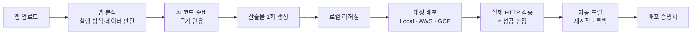

# OneDeploy 개요

기준: 2026-10-06. 심사위원과 처음 보는 사람을 위한 요약이다. 세부는 문서 끝의 링크를 따른다.

## 30초 소개

OneDeploy는 로컬에서 만든 웹 앱을 올리면, AI가 배포에 필요한 코드와 설정을 고치고, 앱에 맞는
환경에 실제로 배포한 뒤, 그 배포가 믿을 만한지까지 증명하는 시스템입니다.

> 한 번의 동작으로 앱에 맞는 환경을 구성하고, 선택한 각 환경에서 같은 배포 기준으로 결과를
> 증명한다.

## 왜 만들었나

배포를 망설이는 이유는 URL이 나오느냐가 아니라, 다음 질문에 답할 수 없어서입니다.

- 로컬에서 되던 것이 클라우드에서도 **같은 것**으로 돌아가는가?
- AI가 내 코드를 **왜, 무엇을** 바꿨는가?
- 재시작해도 살아나는가? 문제가 생기면 **되돌릴 수 있는가?**

OneDeploy는 확인한 항목을 배포 증명서에 기록한다. 재시작·롤백 자동 드릴은 목표 기능이다.

## 목표 구조

아래는 완성 목표를 나타낸다. 현재 구현 범위는 뒤의 상태 표를 따른다.

- **AI는 판단하고, 서버가 실행합니다.** AI에는 셸이나 클라우드 CLI 권한이 없습니다. AI가 낸
  계획은 근거가 실제 소스에 있는지 서버가 검증합니다.
- **성공은 실제 HTTP 응답으로만 판정합니다.** AI가 "됐다"고 말해도 성공이 아닙니다.
- **원본은 그대로 둡니다.** 수정은 작업용 복사본에만 합니다.

## 강조하는 점

| 점 | 내용 |
| --- | --- |
| 스스로 의심하는 배포 | 배포 후 자동 드릴로 재시작과 롤백을 검증하는 기능을 설계했습니다(미구현) |
| 같은 산출물, 같은 기준 | AWS 무상태 경로에서 같은 로컬 이미지를 승격합니다. 전체 대상 적용과 실행 이미지 다이제스트 대조는 목표입니다 |
| 검증하지 않은 것을 밝힘 | 배포 증명서에 검증한 것과 **하지 않은 것**을 함께 적습니다 |
| 실계정 운영 경험 | AWS에서 RDS 생성, SQL 마이그레이션, 데이터 보존 업데이트, 백업 복원, 프로세스 중단 후 복구를 실제로 검증했습니다 |

## 현재 상태 (정직하게)

| 구분 | 내용 |
| --- | --- |
| **동작함 (실검증)** | Local Docker와 AWS ECS Express 실배포, 같은 URL의 v1→v2 업데이트, PostgreSQL RDS 생성·연결·마이그레이션·데이터 보존, 백업 복원 드릴 |
| **구현했지만 실계정 기록 없음** | AWS 완료 릴리스의 이전 버전 롤백 (단위 테스트 기준) |
| **동작하지만 AI는 고정 응답으로만 검증** | AI의 코드 수정·자동 대상 선택 흐름. 실제 모델로 끝까지 실행한 결과는 아직 없음 |
| **코드만 있음** | Google Cloud Run 어댑터 (실계정 미검증) |
| **구현·로컬 검증** | 배포 증명서 v1, 대상별 환경 비교 화면, AWS 무상태 경로의 같은 이미지 로컬 HTTP 리허설·ECR 태그 승격. 변경 경로의 AWS 실계정 검증은 남음 |
| **설계 단계** | 자동 드릴, 실행 중 ECS 다이제스트 대조, 실행 방식 선택, SQLite → PostgreSQL 전환, 다중 대상 배포 |

목업이나 고정 응답을 쓰는 부분은 발표와 화면에서 그렇다고 밝힙니다.

## 사용 기술

- **언어:** Python 3.11+ (표준 라이브러리만), JavaScript (UI, SQL 마이그레이션 실행기)
- **AI:** OpenAI Responses API (함수 호출, 구조화 출력)
- **AWS:** ECS Express Mode, ECR, CloudFormation, RDS PostgreSQL, Secrets Manager, CloudWatch
- **GCP:** Cloud Run, Artifact Registry (어댑터)
- **로컬:** Docker

## 더 읽기

| 알고 싶은 것 | 문서 |
| --- | --- |
| 출제 의도 해석과 요구사항 | [요구사항](requirements.md) |
| 목표 구조 | [목표 설계](target-design.md) |
| 차별화 기능과 방향 전환 과정 | [독창성 설계](originality-design.md) |
| 지금 구현된 구조 | [설계](design.md) |
| 결정과 대안, 논의 과정 | [의사결정 기록](decision-log.md) |
| 남은 작업 | [로드맵](roadmap.md) |
| 검증된 범위 | [현재 상태](status.md) |
