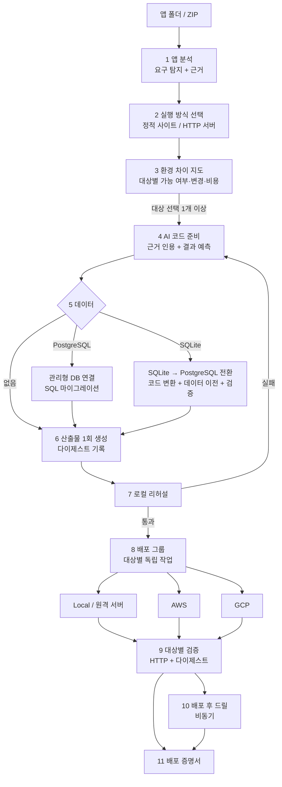

# 목표 설계

기준: 2026-10-06. [출제 의도 해석과 요구사항 명세](requirements.md)를 바탕으로 OneDeploy가
도달할 구조를 정리한다. **설계 문서이며, 각 절에 현재 구현 여부를 표시한다.** 현재 구현 구조는
[설계](design.md), 독창성 기능의 세부는 [독창성 설계](originality-design.md), 작업 순서는
[로드맵](roadmap.md)을 따른다. 요구사항 ID(R-xx)는 [요구사항 명세](requirements.md)를 가리킨다.

## 1. 목표

> 한 번의 동작으로 앱에 맞는 환경을 구성하고, 선택한 각 환경에서 같은 배포 기준으로 결과를
> 증명한다.

출제 의도에 맞춰 세 가지를 동시에 만족하는 구조를 목표로 한다.

1. **적절한 인프라 판단:** 앱을 보고 실행 방식, 대상, 데이터 저장소를 고른다 (R-10~R-14).
2. **공통 기반과 고유 기능의 균형:** 모든 대상이 같은 계약을 따르면서 각 클라우드의 고유 기능을
   쓴다 (R-20~R-25).
3. **운영 책임:** 배포 후에도 버티는지 증명하고, 검증하지 않은 것을 밝힌다 (R-40~R-49).

## 2. 설계 원칙

기존 원칙을 유지하고, 출제 의도 해석에서 나온 원칙을 더한다.

| 원칙 | 출처 |
| --- | --- |
| 성공은 실제 HTTP 응답과 데이터 경로로만 판정한다 | 기존 |
| AI는 판단과 근거를 내고, 실행은 서버의 고정 절차가 한다. AI에 임의 실행 권한을 주지 않는다 | 기존 |
| 원본은 보존하고 작업용 복사본만 바꾼다 | 기존 |
| 결과가 불확실하면 자동으로 다시 실행하지 않는다 | 기존 |
| 지원하지 않는 요구는 리소스를 만들기 전에 이유와 함께 막는다 | 기존 |
| **공통 계약을 먼저 고정하고, 고유 기능은 계약 안에서 대상별로 구현한다** | 출제 의도 |
| **이식성 기본 경로와 고유 기능 경로를 함께 둔다.** 같은 요구를 모든 대상에서 처리하는 경로를 먼저 만들고, 대상에 더 적합한 고유 기능 경로를 추가한다 | 출제 의도 |
| **검증하지 않은 것은 완료로 표시하지 않고, 결과물에 스스로 밝힌다** | 기존 + 개인 설계 |

## 3. 전체 구조

모든 단계는 서버의 작업 기록에 단계별로 남는다. 서버가 중간에 멈추면 이미 끝난 단계는 다시
실행하지 않는다.

## 4. 구성 요소

### 4.1 앱 분석 (R-10, R-12, R-13)

- **현재:** 정적 탐지가 DB 엔진, SQLite, 로컬 파일 쓰기, 워커, Dockerfile 플랫폼을 찾는다
  ([infrastructure.py](../onedeploy/infrastructure.py)). 진입점 분석은 Node `package.json`,
  Python 루트 진입점, 기존 Dockerfile을 다룬다 ([core.py](../onedeploy/core.py)).
- **목표:** 결과를 공통 요구 계약으로 기록한다.

| 영역 | 기록 내용 |
| --- | --- |
| 실행 | 런타임, 진입점, 빌드 산출물 종류(정적 파일 / 서버), 포트, 상태 경로, 필수 환경변수 |
| 데이터 | 무상태 / PostgreSQL / SQLite(파일 포함 여부) / 지원 불가(MySQL, MongoDB 등) |
| 네트워크 | 외부 통신, 공개 필요 여부 |
| 비밀 | 비밀로 다뤄야 할 환경변수 이름 |

- **앱 종류별 확인 계획:** Express·Hono, Next.js(서버 렌더링 / 정적 내보내기), Vite SPA,
  Python(직접 실행·ASGI·WSGI), Dockerfile 앱마다 예제를 두고 실제 배포 기록을 남긴다. Rails는
  Dockerfile 경로로만 지원하고, 런타임 자동 생성 대상에 넣을지는 예제 검증 뒤 정한다.

### 4.2 실행 방식 선택 (R-11) — 새로 추가

출제자의 첫 질문인 "어디에, 어떤 방식으로 배포하나"에 답하는 단계다.

| 실행 방식 | 판단 신호 | 이식성 기본 경로 | 고유 기능 경로 |
| --- | --- | --- | --- |
| **정적 사이트** | 빌드 결과가 정적 파일뿐(예: Vite·CRA 빌드, Next.js 정적 내보내기), 서버 시작 명령이 없거나 정적 서버뿐 | 정적 파일을 경량 웹 서버 컨테이너로 감싸 모든 컨테이너 대상에 배포 | AWS: S3 + CloudFront / GCP: Cloud Storage + CDN |
| **HTTP 서버** | 서버 시작 명령, ASGI·WSGI 객체, Dockerfile | 컨테이너 | AWS: ECS Express / GCP: Cloud Run / 로컬·원격: Docker |

- **판단 순서:** 결정적인 신호(Dockerfile 존재, 빌드 스크립트와 산출물 디렉터리)를 먼저 본다.
  모호하면 AI가 근거를 인용해 제안하고 서버가 검증한다. 기존 인프라 계획 검증
  (`validate_infrastructure_proposal`)과 같은 방식이다.
- **두 경로를 함께 두는 이유:** 정적 사이트를 컨테이너로 감싸는 경로는 어느 대상에서나 같은
  산출물로 동작한다(이식성). S3 + CloudFront 같은 정적 호스팅은 비용과 성능 면에서 더 적절하다
  (고유 기능). 출제 의도의 "공통 추상화와 고유 기능의 균형"을 실행 방식 수준에서 보여준다.
  기본 경로를 먼저 구현하고, 고유 기능 경로는 어댑터를 하나씩 추가한다.
- **채택하지 않은 것 (현 단계):**
  - **서버리스 함수(Lambda, Cloud Functions):** 핸들러 형태로 코드를 바꿔야 해서 "앱 동작을
    유지한다"는 원칙과 충돌 위험이 크다. 실행 방식 표에 "지원 안 함"과 이유를 표시한다.
    ECS Express와 Cloud Run이 요청 기반 확장을 제공하므로, 우선 그 경로로 같은 목적을 충족한다.
  - **VM(EC2, GCE) 직접 생성:** 운영 부담(패치, 접근 관리)이 커서 OneDeploy가 소유할 범위를
    넘는다. 온프레미스 원격 서버 어댑터(4.4)가 "이미 있는 서버에 배포"를 다룬다.

### 4.3 공통 어댑터 계약 (R-20, R-22)

모든 대상 어댑터가 구현하는 계약이다. 세부는 [독창성 설계](originality-design.md) 7.1절.

| 계약 항목 | 정적 사이트 | HTTP 서버 |
| --- | --- | --- |
| 기능 선언 | 정적 호스팅 지원 여부, 공개 범위 | 공개 범위, 영속 데이터, 이미지 플랫폼 |
| 사전 검사·비용 | 저장소·CDN 비용 견적 | 실행 비용 견적 |
| 산출물 수신 | 정적 번들(다이제스트) | 컨테이너 이미지(다이제스트) |
| 배포·검증 | 실제 URL HTTP + 번들 다이제스트 | 실제 URL HTTP + 실행 중 이미지 다이제스트 |
| 드릴 수단 | 이전 번들로 되돌림 | 재시작 유도, 이전 릴리스로 롤백 |
| 소유권·정리 | 소유 태그가 있는 버킷·배포만 | 소유 태그가 있는 서비스·이미지만 |
| 결과 보고 | 증명서 항목 | 증명서 항목 |

현재 어댑터별 충족 상태:

| 대상 | 상태 |
| --- | --- |
| Local Docker | 배포·검증·정리 있음. 재시작 정책 없음, 다이제스트 대조 없음 |
| AWS ECS Express | 배포·검증·정리·롤백 있음. 무상태 경로에서 로컬 HTTP 리허설·같은 로컬 이미지 ECR 태그 승격 구현. ECR 매니페스트 확인 코드 있음; 변경 경로의 AWS 실계정 검증과 실행 중 ECS 다이제스트 대조는 미완료 |
| Cloud Run | 코드만 있음, 실계정 미검증 |
| 정적 호스팅(S3·Cloud Storage), 원격 서버 | 없음 |

### 4.4 대상 (R-02, R-03, R-23, R-25)

| 대상 | 역할 | 상태 |
| --- | --- | --- |
| Local Docker | 리허설 환경이자 온프레미스 대상 | 구현 |
| 원격 서버 (온프레미스) | "자기 PC 위의 VM" 등 이미 있는 서버. 외부 접근 문제도 해결 | 설계 ([독창성 설계](originality-design.md) 7.3절) |
| AWS ECS Express | 주 클라우드 대상, 고유 기능(RDS, Secrets Manager) | 실계정 검증 |
| GCP Cloud Run | 두 번째 하이퍼스케일러. 행사 필수 조건 아님 | 어댑터만 |

### 4.5 데이터 (R-30~R-33)

#### PostgreSQL (현재 경로 유지)

AWS RDS 생성·연결·SQL 마이그레이션·백업·폐기 경로를 유지한다. 세부는
[AWS 데이터 경로](aws-database-path.md). 목표 설계에서는 앱의 논리적 데이터 요구("PostgreSQL이
필요하다")와 AWS 구현(RDS 생성 절차)을 분리해, 다른 대상의 DB 어댑터가 같은 요구를 받을 수
있게 한다 ([이식성 청사진](portability-blueprint.md) 3단계).

#### SQLite → PostgreSQL 전환 (새로 추가, 좁은 지원 범위)

출제자의 첫 번째 예시다. 이전에는 데이터 손실 위험을 이유로 차단했지만, 업로드는 복사본이라
원본 SQLite 파일이 보존된다. 실제 위험은 SQL 방언 차이이므로 **전환 후 검증**으로 다룬다.

**지원 조건 (처음 범위):**

- 업로드에 포함된 SQLite 파일 하나, 또는 파일 없이 스키마만 있는 앱
- 파일 크기 상한(업로드 한도 안), 표준 자료형과 기본 키·외래 키·인덱스
- 앱이 쓰는 드라이버가 PostgreSQL 대응 드라이버로 바꿀 수 있는 것(Node `sqlite3`·
  `better-sqlite3` → `pg`, Python `sqlite3` → `psycopg`)
- 이전은 한 번만 수행한다. 이전하는 동안 원본 앱이 계속 쓰는 상황은 다루지 않는다

**지원하지 않음 (이유와 함께 차단):** 트리거, 가상 테이블·확장, 사용자 정의 함수, 런타임에
여러 SQLite 파일을 만드는 앱, 상한을 넘는 파일.

**절차:**

1. **탐지:** SQLite 사용 코드와 파일을 찾는다(현재 탐지 로직 재사용).
2. **코드 변환:** AI가 작업용 복사본에서 드라이버, 연결 설정(`PG*` 환경변수), SQL 방언
   (자리 표시자 `?` → `$1`, 자동 증가, 날짜 함수 등)을 바꾼다. 변경마다 근거를 남긴다.
3. **스키마 변환:** SQLite 스키마를 PostgreSQL 스키마로 바꾼 SQL 마이그레이션 파일을 만든다.
   기존 SQL 마이그레이션 경로(`migrations/`)로 실행한다.
4. **리허설 이전:** 임시 로컬 PostgreSQL에 데이터를 옮기고, 변환된 앱을 같은 산출물로 실행해
   읽기·쓰기를 확인한다. 실제 클라우드 DB는 건드리지 않는다.
5. **실제 이전:** 리허설이 통과하면 **새로 만든 빈 DB**에만 데이터를 옮긴다. 데이터가 있는
   기존 DB에는 가져오지 않는다.
6. **검증:** 테이블별 행 수, 표본 행의 해시, 앱의 HTTP 읽기·쓰기를 확인한다.
7. **실패 처리:** 검증에 실패하면 전환하지 않는다. 원본 SQLite는 그대로이고, 이전 대상 DB는
   소유자가 확인할 수 있게 보존한 뒤 명시적으로 정리한다.

**증명서 기록:** 원본 파일 체크섬, 테이블별 행 수(원본·대상), 변환된 코드 diff, 검증하지 않은
항목(예: 동시 쓰기, 성능 차이).

### 4.6 산출물과 리허설 (R-21)

- 정적 사이트는 정적 번들, HTTP 서버는 `linux/amd64` 컨테이너 이미지를 **한 번만** 만들고
  다이제스트를 기록한다.
- Local Docker에서 같은 산출물로 리허설한다. 통과해야 클라우드 단계로 간다.
- 클라우드에는 다시 빌드하지 않고 같은 다이제스트를 옮긴다.
- 세부와 한계는 [독창성 설계](originality-design.md) 5절.
- **현재:** AWS 어댑터에서 업로드 직전 같은 `linux/amd64` 이미지를 로컬 루프백 컨테이너로
  실행해 HTTP를 확인하고 같은 로컬 이미지를 ECR 태그로 승격하는 경로가 구현됐다(`onedeploy/rehearsal.py`, 커밋 `cd3e55a`). PostgreSQL 앱은
  별도 DB 경로가 필요해 제외한다. ECR 매니페스트 확인 코드는 있으나 변경 경로의 AWS 실계정 검증과 실행 중 서비스의 다이제스트 대조는 아직 없다.

### 4.7 배포 그룹 (R-24)

- 배포 그룹 = 같은 다이제스트를 공유하는 **대상별 작업 N개**. 기존 작업 구조가 대상 하나의
  상태·정리·재시도·릴리스를 독립적으로 관리하므로 이를 그대로 쓴다.
- 전체 결과: `전체 성공` / `부분 성공` / `전체 실패`. 실패한 대상만 다시 시도한다.
- 단일 대상 이식성을 실증한 뒤에 구현한다. 세부는 [독창성 설계](originality-design.md) 7.2절.

### 4.8 검증, 드릴, 증명서 (R-04, R-43, R-44)

- **검증:** 실제 HTTP와 실행 중 산출물 다이제스트. 이 단계에서 배포 성공을 판정하고 URL을 돌려준다.
- **드릴:** 성공 뒤 비동기로 재시작 내성, 롤백 리허설, 백업 복원을 실행한다. 실패해도 자동으로
  되돌리지 않고 `확인 필요`로 표시한다.
- **증명서:** 바꾼 것, 검증한 것, 검증하지 않은 것, 되돌리기 경로, 비용.
- 세부는 [독창성 설계](originality-design.md) 3절, 6절.
- **현재:** 증명서 v1이 구현됐다(커밋 `eefa6ab`, `onedeploy/certificate.py`). 작업 기록에서 만든
  읽기 전용 스냅샷이며 리허설·이미지 동일성·실제 모델 실행·롤백 리허설을 `unverified`로 명시한다.
  서명, 해시 체인, 드릴 결과, AI 예측 항목은 아직 없다.

### 4.9 AI 계층 (R-50~R-54)

| 역할 | 입력 | 출력 | 서버 검증 |
| --- | --- | --- | --- |
| 실행 방식·대상 제안 | 소스 일부, 사용 가능한 대상 | 실행 방식, 대상, 근거 인용 | 근거가 실제 소스에 있는지, 대상이 후보 안인지 |
| 코드 준비 에이전트 | 작업용 소스, 실패 로그 | 패치, 배포 설정, 결과 예측 | 고정 도구만 사용, 체크섬 고정 |
| SQLite 변환 | SQLite 사용 코드, 스키마 | 코드 패치, PostgreSQL 스키마 | 리허설 이전·검증 통과 |
| 예측 채점 | 배포 전 예측, 실제 결과 | 항목별 적중 | 서버가 채점 (AI 아님) |

- **제공자:** 행사까지 OpenAI를 유지한다. 클라우드에 묶이지 않아 Infinite Clouds 전제와 충돌하지
  않는다. 이후 제공자 인터페이스를 만들고 Amazon Bedrock 등을 선택지로 추가한다. 근거는
  [의사결정 기록](decision-log.md) 2026-10-06.
- **비용:** 배포마다 토큰 사용량과 비용을 기록해 증명서에 넣는다(R-52).

### 4.10 운영과 보안 (R-45~R-49)

| 영역 | 목표 | 현재 |
| --- | --- | --- |
| 비밀값 | 앱 환경변수를 비밀 저장소(Secrets Manager, Secret Manager) 참조로 주입 | ECS 태스크 정의에 평문 |
| 실행 자격 증명 | 최소 권한 역할 위임(AssumeRole, 서비스 계정 가장) | 개인 로그인 |
| 사용자 | 인증·권한, 행위자가 남는 감사 로그, 교체 가능한 상태 저장소 | 단일 토큰, `127.0.0.1`, JSON 파일 |
| 릴리스 | 카나리·블루그린(ECS 배포 설정, Cloud Run 트래픽 분할) | AWS 롤백만 |
| 관측성 | 로그 수집, 지표, 경보, 화면 표시 | 주기적 HTTP 확인 |
| CI/CD | Git push 트리거, GitHub Actions OIDC로 같은 배포 API 호출 | 없음 |
| 빌드 격리 | 신뢰할 수 없는 코드를 격리된 빌드 실행기에서 빌드 | 개발 PC Docker에서 직접 빌드 |

## 5. 단계별 범위

| 단계 | 범위 | 관련 요구사항 |
| --- | --- | --- |
| **행사 전 (10/10까지)** | 공통 어댑터 계약 고정, Local 재시작 정책과 로컬 드릴, 증명서 생성, 단일 빌드·리허설, AWS 승격·드릴, 비밀값 평문 수정, 실행 방식 선택(정적 사이트의 이식성 기본 경로), 실제 모델 검증, 심사위원용 요약 | R-02, R-11, R-20, R-21, R-43, R-44, R-47, R-50, R-62 |
| **가능하면 행사 전** | Cloud Run 실배포, SQLite → PostgreSQL 전환(로컬 리허설까지), 환경 차이 지도 화면 | R-14, R-23, R-31 |
| **행사 후** | 배포 그룹, 원격 서버 어댑터, 정적 호스팅 고유 기능 경로, 카나리, 다중 사용자, CI/CD, 관측성, AI 제공자 분리, 빌드 격리 | R-24, R-25, R-42, R-45, R-46, R-48, R-49, R-54 |

행사 전 범위도 남은 기간에 비해 크다. 실제 진행 순서와 조정은 [로드맵](roadmap.md)에서 관리한다.
구현하지 못한 항목은 이 문서와 요구사항 명세로 "설계와 완료 기준이 있는 미구현 항목"으로
설명한다.

## 6. 검토한 대안

| 대안 | 판단 | 이유 |
| --- | --- | --- |
| 모든 앱을 컨테이너로 배포 (현재) | 기본 경로로 유지하되 실행 방식 선택을 추가 | 이식성은 좋지만 "적절한 인프라 판단"을 보여주지 못한다 |
| 정적 사이트를 처음부터 S3 + CloudFront로만 | 채택하지 않음 | 대상마다 다른 경로가 먼저 생겨 이식성 기본 경로가 없어진다. 컨테이너 기본 경로 다음에 추가한다 |
| 서버리스 함수 지원 | 현 단계에서 채택하지 않음 | 핸들러 변환이 앱 동작을 바꿀 위험. ECS Express·Cloud Run으로 같은 목적 충족 |
| VM 직접 생성 | 채택하지 않음 | 운영 부담이 OneDeploy 범위를 넘는다. 원격 서버 어댑터로 대체 |
| SQLite 앱 차단 유지 | 뒤집음 | 출제자의 첫 예시이고, 원본 보존으로 데이터 손실 위험이 과장됐다 |
| SQLite를 기존 데이터가 있는 DB로 가져오기 | 채택하지 않음 | 충돌과 덮어쓰기 위험. 새 빈 DB로만 이전한다 |
| AI가 SQLite 데이터를 직접 옮김 | 채택하지 않음 | 데이터 이동은 서버의 고정 절차가 하고, AI는 코드·스키마 변환만 한다 |
| AI 제공자를 Bedrock으로 전환 | 행사 전 채택하지 않음 | 일정 위험, AI를 클라우드 하나에 묶는 구조가 테마와 충돌 |
